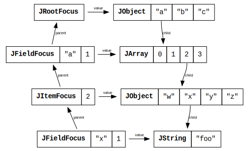

@@@ index
* [X](operations/index.md)
@@@

# Focus

Foci are references to JSON values, possibly nested within other JSON values,
that support operations to navigate around the JSON @ref:[ADT](../model.md),
extract values from the JSON ADT and even transform the JSON ADT into another
one (immutably, through copy-on-write).

A focus essentially consists of:

* the focused JSON value (a `JAny`)
* the parent focus (another `JFocus`)

You can create a focus from a `JAny` using its
@scaladoc:[asRootFocus](org.scalawag.bateman.json.JAny$$JAnyOps#asRootFocus)
extension method.
As the name implies, this will create a root focus (one without a parent
focus and a pointer of `/`), from _any_ JSON value. It doesn't require that
the value actually be a root value -- with no upward-facing references on
`JAny`s, there's no way for a `JAny` to know whether it is contained by
another value. For navigational purposes, the targeted node _is now_
the root of your navigation.

@@@ note
Generally, bateman will create the root focus for you (e.g., when parsing a
text) to prevent any issues you may create by generating a "root"
focus deep within your document. For a `JAny` that you create
programmatically, though, you'll have to create your own root focus.
@@@


@@toc { depth=4 }

## Implementation

@@@ note {title="A Note on Type Safety"}
Foci are strongly typed in bateman. This means that they are sensitive to
your path from the root value. For example, you can't request the parent of
a root focus because it doesn't have one. As long as you are only using the
focus API, this strong type safety is preserved. You will often find that
it's easier and more readable to use @ref:[lenses](../lens/index.md), however, 
which return less-strongly-typed foci.

Hopefully this weakening will go away for the Scala 3 implementation.
@@@

While the primary ADT for bateman contains only _downward_ references -- a
`JObject` refers to its children, but the children do not refer back up to
the parent -- foci contain only _upward_ references. Using this dual data
structure, immutability is preserved while still providing a convenient API.

Here's a simplified example (only the child references that take part in 
the focus are shown) of the structure of a deep focus to the value at `/a/2/x`.
Note that `JFieldFocus` also maintains the field _index_ since the name 
itself is not necessarily unambiguous in the presence of duplicate field names.

```json
{
  "a": [
    null,
    2,
    {
      "w": 1,
      "x": "foo",
      "y": false,
      "z": []
    },
    {}
  ],
  "b": 34.5,
  "c": "bar"
}
```



